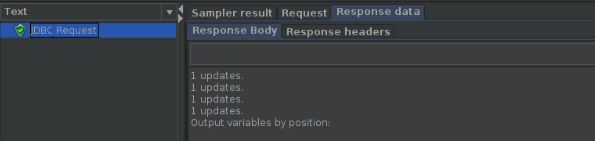
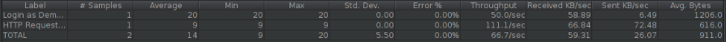

# ES20 P2 submission, Group 25

## Feature PPA

### Subgroup
 - Baltasar Dinis, 89416, bsdinis
   + Issues assigned:
   [#14](https://github.com/tecnico-softeng/es20al_25-project/issues/14),
   [#15](https://github.com/tecnico-softeng/es20al_25-project/issues/15),
   [#16](https://github.com/tecnico-softeng/es20al_25-project/issues/16),
   [#64](https://github.com/tecnico-softeng/es20al_25-project/issues/64),
   [#88](https://github.com/tecnico-softeng/es20al_25-project/issues/88),
   [#105](https://github.com/tecnico-softeng/es20al_25-project/issues/105),
   [#107](https://github.com/tecnico-softeng/es20al_25-project/issues/107)
 - Lourenço Teodoro, 86591, ISTTeo
   + Issues assigned:
   [#17](https://github.com/tecnico-softeng/es20al_25-project/issues/17),
   [#55](https://github.com/tecnico-softeng/es20al_25-project/issues/55),
   [#56](https://github.com/tecnico-softeng/es20al_25-project/issues/56),
   [#87](https://github.com/tecnico-softeng/es20al_25-project/issues/87),
   [#104](https://github.com/tecnico-softeng/es20al_25-project/issues/104),
   [#106](https://github.com/tecnico-softeng/es20al_25-project/issues/106)

### Pull requests associated with this feature

The list of pull requests associated with this feature is:

 - [PR #17](https://github.com/tecnico-softeng/es20al_25-project/pull/17)
 - [PR #68](https://github.com/tecnico-softeng/es20al_25-project/pull/68)
 - [PR #78](https://github.com/tecnico-softeng/es20al_25-project/pull/78)
 - [PR #79](https://github.com/tecnico-softeng/es20al_25-project/pull/79)
 - [PR #86](https://github.com/tecnico-softeng/es20al_25-project/pull/86)
 - [PR #92](https://github.com/tecnico-softeng/es20al_25-project/pull/92)
 - [PR #101](https://github.com/tecnico-softeng/es20al_25-project/pull/101)
 - [PR #102](https://github.com/tecnico-softeng/es20al_25-project/pull/102)
 - [PR #103](https://github.com/tecnico-softeng/es20al_25-project/pull/103)
 - [PR #109](https://github.com/tecnico-softeng/es20al_25-project/pull/109)
 - [PR #110](https://github.com/tecnico-softeng/es20al_25-project/pull/110)
 - [PR #111](https://github.com/tecnico-softeng/es20al_25-project/pull/111)
 - [PR #115](https://github.com/tecnico-softeng/es20al_25-project/pull/115)
 - [PR #117](https://github.com/tecnico-softeng/es20al_25-project/pull/117)

### Web services definition

#### Controllers
 - [QuestionProposalController](https://github.com/tecnico-softeng/es20al_25-project/blob/develop/backend/src/main/java/pt/ulisboa/tecnico/socialsoftware/tutor/question/api/QuestionProposalController.java)

### Feature testing

Each subgroup member defined one reading test and one writing test. The direct links to these are:

 - [ReadingTestJMeter: ListProposal](https://github.com/tecnico-softeng/es20al_25-project/blob/develop/backend/jmeter/question/WSGetStudentProposalTest.jmx)
 - [WritingTestJMeter: SubmitProposal](https://github.com/tecnico-softeng/es20al_25-project/blob/develop/backend/jmeter/question/WSSubmitStudentProposalTest.jmx)
 - [WritingTestJMeter: ReviewProposal](https://github.com/tecnico-softeng/es20al_25-project/blob/develop/backend/jmeter/question/WSReviewQuestionProposalTest.jmx)

#### Screenshots of Results Trees and DB cleanup

### Load testing

Each subgroup member defined one reading test and one writing test. The direct links to these are:

 - [ReadingTestJMeter: ListProposal](https://github.com/tecnico-softeng/es20al_25-project/blob/develop/backend/jmeter/question/WSGetStudentProposalLoadTest.jmx)
 - [WritingTestJMeter: SubmitProposal](https://github.com/tecnico-softeng/es20al_25-project/blob/develop/backend/jmeter/question/WSSubmitStudentProposalLoadTest.jmx)
 - [WritingTestJMeter: ReviewProposal](https://github.com/tecnico-softeng/es20al_25-project/blob/develop/backend/jmeter/question/WSReviewQuestionProposalLoadTest.jmx)

#### Screenshots of Summary Reports and DB cleanup

### Service profiling

We used the [Async Profiler](https://www.jetbrains.com/help/idea/async-profiler.html).

#### Screenshots of summary reports

Proposal Review

List Proposal

Submit Proposal

#### Discussion of findings

Hibernate forced us to change a lot of `fetchTypes` to `EAGER`. This incurs a significant performance pessimisation, one for which we did not sacrifice maintainability.

---

## Feature DDP

### Subgroup
 - Tiago Lé, ist18550, tigasgon1999
   + Issues assigned: [#61](https://github.com/tecnico-softeng/es20al_25-project/issues/61), [#62](https://github.com/tecnico-softeng/es20al_25-project/issues/62), [#89](https://github.com/tecnico-softeng/es20al_25-project/issues/89), [#90](https://github.com/tecnico-softeng/es20al_25-project/issues/90)
 - Vasco Rodrigues, ist189557, vbgcr
   + Issues assigned: [#59](https://github.com/tecnico-softeng/es20al_25-project/issues/59), [#60](https://github.com/tecnico-softeng/es20al_25-project/issues/21), [#89](https://github.com/tecnico-softeng/es20al_25-project/issues/89), [#90](https://github.com/tecnico-softeng/es20al_25-project/issues/90)

### Pull requests associated with this feature

The list of pull requests associated with this feature is:

 - [PR #96](https://github.com/tecnico-softeng/es20al_25-project/pull/96)
 - [PR #116](https://github.com/tecnico-softeng/es20al_25-project/pull/116)

### Web services definition

#### Controllers
 - [DiscussionController](https://github.com/tecnico-softeng/es20al_25-project/blob/develop/backend/src/main/java/pt/ulisboa/tecnico/socialsoftware/tutor/discussion/DiscussionController.java)
 - [ReplyController](https://github.com/tecnico-softeng/es20al_25-project/blob/develop/backend/src/main/java/pt/ulisboa/tecnico/socialsoftware/tutor/reply/ReplyController.java)

### Feature testing

Each subgroup member defined one reading test and one writing test. The direct links to these are:

  - [WSCreateNewDiscussionTest](https://github.com/tecnico-softeng/es20al_25-project/blob/develop/backend/jmeter/discussion/WSCreateNewDiscussionTest.jmx)
  - [WSGetDiscussionStatusTest](https://github.com/tecnico-softeng/es20al_25-project/blob/develop/backend/jmeter/discussion/WSGetDiscussionStatusTest.jmx)
  - [WSCreateNewReplyTest](https://github.com/tecnico-softeng/es20al_25-project/blob/develop/backend/jmeter/reply/WSCreateNewReplyTest.jmx)
  - [WSFindReplyTest](https://github.com/tecnico-softeng/es20al_25-project/blob/develop/backend/jmeter/reply/WSFindReplyTest.jmx)

#### Screenshots of Results Trees and DB cleanup

##### CreateDiscussion

##### GetDiscussionStatus

##### CreateReply

##### FindReply

### Load testing

Each subgroup member defined one reading test and one writing test. The direct links to these are:

 - [WSCreateNewDiscussionLoadTest](https://github.com/tecnico-softeng/es20al_25-project/blob/develop/backend/jmeter/discussion/WSCreateNewDiscussionLoadTest.jmx)
 - [WSGetDiscussionStatusLoadTest](https://github.com/tecnico-softeng/es20al_25-project/blob/develop/backend/jmeter/discussion/WSGetDiscussionStatusLoadTest.jmx)
 - [WSCreateNewReplyLoadTest](https://github.com/tecnico-softeng/es20al_25-project/blob/develop/backend/jmeter/reply/WSCreateNewReplyLoadTest.jmx)
 - [WSFindReplyLoadTest](https://github.com/tecnico-softeng/es20al_25-project/blob/develop/backend/jmeter/reply/WSFindReplyLoadTest.jmx)

#### Screenshots of Summary Reports and DB cleanup

##### CreateDiscussion

##### GetDiscussionStatus

##### CreateReply

##### FindReply

### Service profiling

We used the [Async Profiler](https://www.jetbrains.com/help/idea/async-profiler.html).

[NOTA] Não conseguimos tirar screenshots aos testes de profiling. Deveriam ter sido criados issues relativos aos testes de performance, mas só nos apercebemos deste facto depois de termos feito todos os commits relativos a estes testes.

---

## Feature TDP

### Subgroup
 - Andreia Pereira, ist189414, decasppereira
   + Issues assigned: [#72](https://github.com/tecnico-softeng/es20al_25-project/issues/72), [#73](https://github.com/tecnico-softeng/es20al_25-project/issues/73), [#114](https://github.com/tecnico-softeng/es20al_25-project/issues/114)
 - Diogo Pacheco, ist189433, Dpac99
   + Issues assigned: [#74](https://github.com/tecnico-softeng/es20al_25-project/issues/74), [#75](https://github.com/tecnico-softeng/es20al_25-project/issues/75), [#80](https://github.com/tecnico-softeng/es20al_25-project/issues/80), [#81](https://github.com/tecnico-softeng/es20al_25-project/issues/81), [#82](https://github.com/tecnico-softeng/es20al_25-project/issues/82), [#83](https://github.com/tecnico-softeng/es20al_25-project/issues/83), [#84](https://github.com/tecnico-softeng/es20al_25-project/issues/84), [#100](https://github.com/tecnico-softeng/es20al_25-project/issues/100), [#112](https://github.com/tecnico-softeng/es20al_25-project/issues/112), [#113](https://github.com/tecnico-softeng/es20al_25-project/issues/113)

### Pull requests associated with this feature

The list of pull requests associated with this feature is:

 - [PR #093](https://github.com/tecnico-softeng/es20al_25-project/pull/93)
 - [PR #119](https://github.com/tecnico-softeng/es20al_25-project/pull/119)

### Web services definition

#### Controllers
 - [TournamentController](https://github.com/tecnico-softeng/es20al_25-project/blob/develop/backend/src/main/java/pt/ulisboa/tecnico/socialsoftware/tutor/tournament/TournamentController.java)

### Feature testing

Each subgroup member defined one reading test and one writing test. The direct links to these are:

 - [WSGetTournamentsTest](https://github.com/tecnico-softeng/es20al_25-project/blob/develop/backend/jmeter/tournament/WSGetTournamentsTest.jmx)
 - [WSCreateTournamentsTest](https://github.com/tecnico-softeng/es20al_25-project/blob/develop/backend/jmeter/tournament/WSCreateTournamentsTest.jmx)
 - [WSEnrollInTournamentTest](https://github.com/tecnico-softeng/es20al_25-project/blob/develop/backend/jmeter/tournament/WSEnrollInTournamentTest.jmx)

#### Screenshots of Results Trees and DB cleanup

##### Create

##### Get

##### Enroll

### Load testing

Each subgroup member defined one reading test and one writing test. The direct links to these are:

 - [WSGetTournamentsLoadTest](https://github.com/tecnico-softeng/es20al_25-project/blob/develop/backend/jmeter/tournament/WSCreateTournamentLoadTest.jmx)
 - [WSCreateTournamentLoadTest](https://github.com/tecnico-softeng/es20al_25-project/blob/develop/backend/jmeter/tournament/WSGetTournamentsLoadTest.jmx)
 - [WSEnrollInTournamentLoadTest](https://github.com/tecnico-softeng/es20al_25-project/blob/develop/backend/jmeter/tournament/WSEnrollInTournamentLoadTest.jmx)

#### Screenshots of Summary Reports and DB cleanup

##### Create

##### Get

##### Enroll

### Service profiling

We used the [Async Profiler](https://www.jetbrains.com/help/idea/async-profiler.html).

#### Screenshots of summary reports

##### Create

##### Enroll

##### Get

#### Discussion of findings

   * Database accesses are a chokepoint
