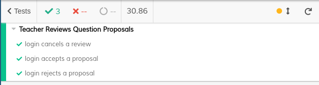

# ES20 P3 submission, Group 25

## Feature PPA

### Subgroup
 - Baltasar Dinis, 89416, bsdinis
   + Issues assigned:
   [#142](https://github.com/tecnico-softeng/es20al_25-project/issues/142),
   [#143](https://github.com/tecnico-softeng/es20al_25-project/issues/143),
   [#144](https://github.com/tecnico-softeng/es20al_25-project/issues/144),
   [#151](https://github.com/tecnico-softeng/es20al_25-project/issues/151),
   [#152](https://github.com/tecnico-softeng/es20al_25-project/issues/152),
   [#153](https://github.com/tecnico-softeng/es20al_25-project/issues/153),
   [#154](https://github.com/tecnico-softeng/es20al_25-project/issues/154),
   [#155](https://github.com/tecnico-softeng/es20al_25-project/issues/155),
   [#156](https://github.com/tecnico-softeng/es20al_25-project/issues/156),
   [#157](https://github.com/tecnico-softeng/es20al_25-project/issues/157),
   [#160](https://github.com/tecnico-softeng/es20al_25-project/issues/160),
   [#161](https://github.com/tecnico-softeng/es20al_25-project/issues/161),
   [#162](https://github.com/tecnico-softeng/es20al_25-project/issues/162),
   [#179](https://github.com/tecnico-softeng/es20al_25-project/issues/179),

 - Lourenço Teodoro, 86591, ISTTeo
   + Issues assigned:
   [#125](https://github.com/tecnico-softeng/es20al_25-project/issues/125),
   [#133](https://github.com/tecnico-softeng/es20al_25-project/issues/133),
   [#138](https://github.com/tecnico-softeng/es20al_25-project/issues/138),
   [#140](https://github.com/tecnico-softeng/es20al_25-project/issues/140),
   [#170](https://github.com/tecnico-softeng/es20al_25-project/issues/170),

### Pull requests associated with this feature

The list of pull requests associated with this feature is:
 - [PR #126](https://github.com/tecnico-softeng/es20al_25-project/pull/126)
 - [PR #139](https://github.com/tecnico-softeng/es20al_25-project/pull/139)
 - [PR #145](https://github.com/tecnico-softeng/es20al_25-project/pull/145)
 - [PR #159](https://github.com/tecnico-softeng/es20al_25-project/pull/159)
 - [PR #163](https://github.com/tecnico-softeng/es20al_25-project/pull/163)
 - [PR #166](https://github.com/tecnico-softeng/es20al_25-project/pull/166)
 - [PR #171](https://github.com/tecnico-softeng/es20al_25-project/pull/171)
 - [PR #172](https://github.com/tecnico-softeng/es20al_25-project/pull/172)
 - [PR #176](https://github.com/tecnico-softeng/es20al_25-project/pull/176)
 - [PR #177](https://github.com/tecnico-softeng/es20al_25-project/pull/177)
 - [PR #180](https://github.com/tecnico-softeng/es20al_25-project/pull/180)

### Frontend

#### New/Updated Views

 - [TeacherProposalsView](https://github.com/tecnico-softeng/es20al_25-project/blob/develop/frontend/src/views/teacher/TeacherProposalsView.vue)
 - [QuestionProposalView](https://github.com/tecnico-softeng/es20al_25-project/blob/develop/frontend/src/views/student/proposal/QuestionProposalsView.vue)
 - [SubmitQuestionProposalDialog](https://github.com/tecnico-softeng/es20al_25-project/blob/develop/frontend/src/views/student/proposal/SubmitQuestionProposalDialog.vue)
 - [ProposalList](https://github.com/tecnico-softeng/es20al_25-project/blob/develop/frontend/src/views/student/proposal/ProposalList.vue)

#### New/Updated Models

 - [QuestionProposal](https://github.com/tecnico-softeng/es20al_25-project/blob/develop/frontend/src/models/management/QuestionProposal.ts)
 - [ProposalReview](https://github.com/tecnico-softeng/es20al_25-project/blob/develop/frontend/src/models/management/ProposalReview.ts)

### Additional services implemented

 - [Teacher List Available Question Proposals]()
    + [Spock tests](https://github.com/tecnico-softeng/es20al_25-project/blob/develop/backend/src/test/groovy/pt/ulisboa/tecnico/socialsoftware/tutor/question/service/TeacherListQuestionProposalTest.groovy)
    + [Service Implementation](https://github.com/tecnico-softeng/es20al_25-project/blob/develop/backend/src/main/java/pt/ulisboa/tecnico/socialsoftware/tutor/question/QuestionProposalService.java)
    + [Controller](https://github.com/tecnico-softeng/es20al_25-project/blob/develop/backend/src/main/java/pt/ulisboa/tecnico/socialsoftware/tutor/question/api/QuestionProposalController.java)
    + [Feature test (JMeter)](https://github.com/tecnico-softeng/es20al_25-project/blob/develop/backend/jmeter/question/WSTeacherListQuestionProposal.jmx)

### End-to-end tests

#### Created tests

 - [Create Question Proposal Test](https://github.com/tecnico-softeng/es20al_25-project/blob/develop/frontend/tests/e2e/specs/student/submitQuestionProposal.js)
 - [Review Question Proposal](https://github.com/tecnico-softeng/es20al_25-project/blob/develop/frontend/tests/e2e/specs/teacher/submitProposalReview.js)
 - [List Teacher Proposals](https://github.com/tecnico-softeng/es20al_25-project/blob/develop/frontend/tests/e2e/specs/teacher/listQuestionProposal.js)

#### Rationale

Tests verify the basic usability of each new feature, for example filling a new proposal and checking for the listing.
They are somewhat extensive regarding the combinations, in the submit proposal example we create multiple proposals with different types of input (options, image, only text).
An important thing which is relegated to future work is that at the moment there is no way to cleanup the state of the tests. For that reason some tests need to account for this fact (eg. insert a new review and instead of checking there is one review on the list, we verify that there is at least one)

Tests:
  - submitQuestionProposal: Login as a student and submit a question proposal (trying out the different UI options). Also verifies that the corresponding reviews appear on the page.
  - listQuestionProposal: Login as a student to submit proposals. Login as teacher to list available proposals. Verifies that the number of proposals listed is correct and verifies that the search bar works properly.
  - submitProposalReview: Login as student and submit two proposals. Login as teacher to test all different review API's (cancel, approve and reject).

#### Commands defined

 - [commands.js](https://github.com/tecnico-softeng/es20al_25-project/blob/DdP/frontend/cypress/support/commands.js)
 - clickStudentViewProposalTopbar
 - checkProposals
 - clickStudentCreateProposalTopbar
 - submitQuestionProposalClickBtn
 - searchProposal
 - submitQuestionProposalNoNeedToClick
 - addOptionsWithoutCorrect
 - addOptionsWithCorrect
 - addImage
 - clickSubmitProposalBtn
 - checkError
 - loginDemoTeacher
 - getProposalCount

#### Screenshot of test results overview

---

## Feature DDP

### Subgroup

 - Tiago Lé, ist18550, tigasgon1999
   + Issues assigned: [#146](https://github.com/tecnico-softeng/es20al_25-project/issues/146), [#147](https://github.com/tecnico-softeng/es20al_25-project/issues/147), [#164](https://github.com/tecnico-softeng/es20al_25-project/issues/164), [#165](https://github.com/tecnico-softeng/es20al_25-project/issues/165)
 - Vasco Rodrigues, ist189557, vbgcr
   + Issues assigned: [#136](https://github.com/tecnico-softeng/es20al_25-project/issues/136), [#137](https://github.com/tecnico-softeng/es20al_25-project/issues/137)

### Pull requests associated with this feature

The list of pull requests associated with this feature is:

 - [PR #167](https://github.com/tecnico-softeng/es20al_25-project/pull/167)

### Frontend

#### New/Updated Views

 - [TeacherDiscussionView](https://github.com/tecnico-softeng/es20al_25-project/blob/DdP/frontend/src/views/teacher/discussions/TeacherDiscussionsView.vue)
 - [ShowDIscussionDialog](https://github.com/tecnico-softeng/es20al_25-project/blob/DdP/frontend/src/views/teacher/ShowDiscussionDialog.vue)
 - [ResultComponent](https://github.com/tecnico-softeng/es20al_25-project/blob/DdP/frontend/src/views/student/quiz/ResultComponent.vue)
 - [DiscussionsView](https://github.com/tecnico-softeng/es20al_25-project/blob/DdP/frontend/src/views/student/DiscussionsView.vue)
 - [ShowReplyDialog](https://github.com/tecnico-softeng/es20al_25-project/blob/DdP/frontend/src/views/student/ShowReplyDialog.vue)
 - [TopBar](https://github.com/tecnico-softeng/es20al_25-project/blob/DdP/frontend/src/components/TopBar.vue)
 - [Homeview](https://github.com/tecnico-softeng/es20al_25-project/blob/DdP/frontend/src/views/HomeView.vue)
 - [QuestionComponent](https://github.com/tecnico-softeng/es20al_25-project/blob/DdP/frontend/src/views/student/quiz/QuestionComponent.vue)
 - [QuizzView](https://github.com/tecnico-softeng/es20al_25-project/blob/DdP/frontend/src/views/student/quiz/QuizView.vue)

#### New/Updated Models

 - [StatementQuestion](https://github.com/tecnico-softeng/es20al_25-project/blob/DdP/frontend/src/models/statement/StatementQuestion.ts)
 - [Discussion](https://github.com/tecnico-softeng/es20al_25-project/blob/DdP/frontend/src/models/management/Discussion.ts)
 - [Reply](https://github.com/tecnico-softeng/es20al_25-project/blob/DdP/frontend/src/models/management/Reply.ts)

### Additional services implemented

 - [GetQuestionsDiscussions](https://github.com/tecnico-softeng/es20al_25-project/blob/DdP/backend/src/main/java/pt/ulisboa/tecnico/socialsoftware/tutor/discussion/DiscussionService.java)
    + [Controller](https://github.com/tecnico-softeng/es20al_25-project/blob/DdP/backend/src/main/java/pt/ulisboa/tecnico/socialsoftware/tutor/discussion/DiscussionController.java)
    + [Spock tests](https://github.com/tecnico-softeng/es20al_25-project/blob/DdP/backend/src/test/groovy/pt/ulisboa/tecnico/socialsoftware/tutor/discussion/service/GetQuestionsDiscussionsServiceSpockTest.groovy)
    + [Feature test (JMeter)](https://github.com/tecnico-softeng/es20al_25-project/blob/DdP/backend/jmeter/discussion/WSGetQuestionsDiscussions.jmx)

 - [GetDiscussionQuestion](https://github.com/tecnico-softeng/es20al_25-project/blob/DdP/backend/src/main/java/pt/ulisboa/tecnico/socialsoftware/tutor/discussion/DiscussionService.java)
    + [Controller](https://github.com/tecnico-softeng/es20al_25-project/blob/DdP/backend/src/main/java/pt/ulisboa/tecnico/socialsoftware/tutor/discussion/DiscussionController.java)
    + [Spock tests](https://github.com/tecnico-softeng/es20al_25-project/blob/DdP/backend/src/test/groovy/pt/ulisboa/tecnico/socialsoftware/tutor/discussion/service/GetDiscussionQuestionServiceSpockTest.groovy)
    + [Feature test (JMeter)](https://github.com/tecnico-softeng/es20al_25-project/blob/DdP/backend/jmeter/discussion/WSGetDiscussionQuestion.jmx)

### End-to-end tests

#### Created tests

 - [Discussion and Reply walkthrough](https://github.com/tecnico-softeng/es20al_25-project/blob/DdP/frontend/tests/e2e/specs/discussion/discussionAndReply.js)

#### Rationale
O teste cobre as 3 features desenvolvidas, ou seja, cria uma discussão (antes disso responde a um quizz para poder criar uma discussão em relação a uma pergunta). Depois o professor responde à discussão criada pelo aluno. Finalmente, o aluno visualiza a resposta do professor.
[NOTA: para que o teste corra sem problemas, é preciso comentar as linhas 135, 136, 137 e 139 do AuthService.java.]

#### Commands defined

 - [commands.js](https://github.com/tecnico-softeng/es20al_25-project/blob/DdP/frontend/cypress/support/commands.js)

#### Screenshot of test results overview

---

## Feature TDP

### Subgroup

 - Andreia Pereira, ist89414, decasppereira
   + Issues assigned: [#129](https://github.com/tecnico-softeng/es20al_25-project/issues/129), [#130](https://github.com/tecnico-softeng/es20al_25-project/issues/130), [#131](https://github.com/tecnico-softeng/es20al_25-project/issues/131), [#132](https://github.com/tecnico-softeng/es20al_25-project/issues/132), [#150](https://github.com/tecnico-softeng/es20al_25-project/issues/150)
 - Diogo Pacheco, ist89433, Dpac99
   + Issues assigned: [#127](https://github.com/tecnico-softeng/es20al_25-project/issues/127), [#128](https://github.com/tecnico-softeng/es20al_25-project/issues/128), [#148](https://github.com/tecnico-softeng/es20al_25-project/issues/148)

### Pull requests associated with this feature

The list of pull requests associated with this feature is:

 - [PR #169](https://github.com/tecnico-softeng/es20al_25-project/pull/169)
 - [PR #175](https://github.com/tecnico-softeng/es20al_25-project/pull/175)

### Frontend

#### New/Updated Views

 - [CreateTournamentView](https://github.com/tecnico-softeng/es20al_25-project/blob/develop/frontend/src/views/student/tournament/CreateTournamentView.vue)
 - [OpenTournamentsView](https://github.com/tecnico-softeng/es20al_25-project/blob/develop/frontend/src/views/student/tournament/OpenTournamentsView.vue)
  - [TopBar](https://github.com/tecnico-softeng/es20al_25-project/blob/develop/frontend/src/components/TopBar.vue)

#### New/Updated Models

 - [User](https://github.com/tecnico-softeng/es20al_25-project/blob/develop/frontend/src/models/user/User.ts)
 - [Tournament](https://github.com/tecnico-softeng/es20al_25-project/blob/develop/frontend/src/models/management/Tournament.ts)

### Additional services implemented

### End-to-end tests

#### Created tests

 - [Login creates and deletes a tournament](https://github.com/tecnico-softeng/es20al_25-project/blob/develop/frontend/tests/e2e/specs/tournament/tournamentTest.js#L8)
 - [Login creates a tournament, logout and enrolls in that tournament](https://github.com/tecnico-softeng/es20al_25-project/blob/develop/frontend/tests/e2e/specs/tournament/tournamentTest.js#L14)

#### Rationale
O teste cobre as 3 funcionalidades. No teste para criar torneios, o torneio é criado e logo de seguida são listados os torneios para verificar que lá está. Uma lógica semelhante é empregada no teste de inscrever mas após criar o torneio é feito login com outro user para se inscrever.

#### Commands defined

 - [commands.js - LoginNavCreateTournament](https://github.com/tecnico-softeng/es20al_25-project/blob/develop/frontend/tests/e2e/support/commands.js#L124)
 - [commands.js - createTournament](https://github.com/tecnico-softeng/es20al_25-project/blob/develop/frontend/tests/e2e/support/commands.js#L132)
 - [commands.js - deleteTournament](https://github.com/tecnico-softeng/es20al_25-project/blob/develop/frontend/tests/e2e/support/commands.js#L132)
 - [commands.js - LoginNavEnrollTournament](https://github.com/tecnico-softeng/es20al_25-project/blob/develop/frontend/tests/e2e/support/commands.js#L132)
 - [commands.js - enrollInTournament](https://github.com/tecnico-softeng/es20al_25-project/blob/develop/frontend/tests/e2e/support/commands.js#L132)
#### Screenshot of test results overview

