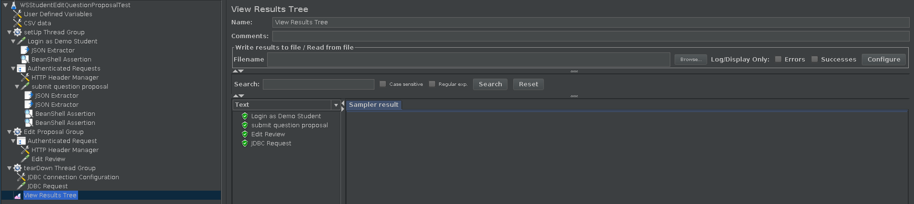

# ES20 P4 submission, Group 5

Important note: the Dashboard is shared amongst sub-groups, because it is important for it to share infrastructure (both in terms of the statistics and the preferences). For that reason a seperate branch (`user-stats`) was created, and the backend was implemented fully (with clear insertion points) and templates for the frontend were also implemented. Furthermore, the tests (both Jmeter, Spock and Cypress) are shared between different sub-groups (but each implemented the specifics for their sub-feature).

## Feature PPA

### Subgroup

 - Baltasar Dinis, 89416, bsdinis
   + Issues assigned:
   [#232](https://github.com/tecnico-softeng/es20al_25-project/issues/232), [#185](https://github.com/tecnico-softeng/es20al_25-project/issues/185), [#271](https://github.com/tecnico-softeng/es20al_25-project/issues/271), [#272](https://github.com/tecnico-softeng/es20al_25-project/issues/272), [#273](https://github.com/tecnico-softeng/es20al_25-project/issues/273), [#274](https://github.com/tecnico-softeng/es20al_25-project/issues/274), [#275](https://github.com/tecnico-softeng/es20al_25-project/issues/275), [#276](https://github.com/tecnico-softeng/es20al_25-project/issues/276), [#279](https://github.com/tecnico-softeng/es20al_25-project/issues/279), [#280](https://github.com/tecnico-softeng/es20al_25-project/issues/280), [#281](https://github.com/tecnico-softeng/es20al_25-project/issues/281), [#282](https://github.com/tecnico-softeng/es20al_25-project/issues/282), [#283](https://github.com/tecnico-softeng/es20al_25-project/issues/283), [#284](https://github.com/tecnico-softeng/es20al_25-project/issues/284), [#287](https://github.com/tecnico-softeng/es20al_25-project/issues/287), [#288](https://github.com/tecnico-softeng/es20al_25-project/issues/288), [#289](https://github.com/tecnico-softeng/es20al_25-project/issues/289), [#290](https://github.com/tecnico-softeng/es20al_25-project/issues/290), [#291](https://github.com/tecnico-softeng/es20al_25-project/issues/291), [#292](https://github.com/tecnico-softeng/es20al_25-project/issues/292), [#296](https://github.com/tecnico-softeng/es20al_25-project/issues/296), [#304](https://github.com/tecnico-softeng/es20al_25-project/issues/304), [#305](https://github.com/tecnico-softeng/es20al_25-project/issues/305), [#306](https://github.com/tecnico-softeng/es20al_25-project/issues/306), [#307](https://github.com/tecnico-softeng/es20al_25-project/issues/307), [#308](https://github.com/tecnico-softeng/es20al_25-project/issues/308), [#312](https://github.com/tecnico-softeng/es20al_25-project/issues/312), [#313](https://github.com/tecnico-softeng/es20al_25-project/issues/313), [#314](https://github.com/tecnico-softeng/es20al_25-project/issues/314), [#316](https://github.com/tecnico-softeng/es20al_25-project/issues/316), [#317](https://github.com/tecnico-softeng/es20al_25-project/issues/317), [#318](https://github.com/tecnico-softeng/es20al_25-project/issues/318), [#319](https://github.com/tecnico-softeng/es20al_25-project/issues/319), [#320](https://github.com/tecnico-softeng/es20al_25-project/issues/320), [#321](https://github.com/tecnico-softeng/es20al_25-project/issues/321), [#322](https://github.com/tecnico-softeng/es20al_25-project/issues/322), [#323](https://github.com/tecnico-softeng/es20al_25-project/issues/323), [#324](https://github.com/tecnico-softeng/es20al_25-project/issues/324), [#325](https://github.com/tecnico-softeng/es20al_25-project/issues/325), [#341](https://github.com/tecnico-softeng/es20al_25-project/issues/341)
 - Lourenço Teodoro, 86591, ISTTeo
   + Issues assigned:
   [#277](https://github.com/tecnico-softeng/es20al_25-project/issues/277), [#278](https://github.com/tecnico-softeng/es20al_25-project/issues/278), [#285](https://github.com/tecnico-softeng/es20al_25-project/issues/285), [#286](https://github.com/tecnico-softeng/es20al_25-project/issues/286), [#293](https://github.com/tecnico-softeng/es20al_25-project/issues/293), [#294](https://github.com/tecnico-softeng/es20al_25-project/issues/294), [#301](https://github.com/tecnico-softeng/es20al_25-project/issues/301), [#302](https://github.com/tecnico-softeng/es20al_25-project/issues/302), [#303](https://github.com/tecnico-softeng/es20al_25-project/issues/303), [#305](https://github.com/tecnico-softeng/es20al_25-project/issues/305), [#306](https://github.com/tecnico-softeng/es20al_25-project/issues/306), [#307](https://github.com/tecnico-softeng/es20al_25-project/issues/307), [#308](https://github.com/tecnico-softeng/es20al_25-project/issues/308), [#309](https://github.com/tecnico-softeng/es20al_25-project/issues/309), [#310](https://github.com/tecnico-softeng/es20al_25-project/issues/310), [#311](https://github.com/tecnico-softeng/es20al_25-project/issues/311), [#313](https://github.com/tecnico-softeng/es20al_25-project/issues/313), [#316](https://github.com/tecnico-softeng/es20al_25-project/issues/316), [#317](https://github.com/tecnico-softeng/es20al_25-project/issues/317), [#319](https://github.com/tecnico-softeng/es20al_25-project/issues/319), [#326](https://github.com/tecnico-softeng/es20al_25-project/issues/326), [#327](https://github.com/tecnico-softeng/es20al_25-project/issues/327), [#328](https://github.com/tecnico-softeng/es20al_25-project/issues/328), [#349](https://github.com/tecnico-softeng/es20al_25-project/issues/349), [#350](https://github.com/tecnico-softeng/es20al_25-project/issues/350)

### Pull requests associated with this feature

The list of pull requests associated with this feature is:

 - [PR #299](https://github.com/tecnico-softeng/es20al_25-project/pull/299)
 - [PR #315](https://github.com/tecnico-softeng/es20al_25-project/pull/315)
 - [PR #329](https://github.com/tecnico-softeng/es20al_25-project/pull/329)
 - [PR #330](https://github.com/tecnico-softeng/es20al_25-project/pull/330)
 - [PR #331](https://github.com/tecnico-softeng/es20al_25-project/pull/331)
 - [PR #340](https://github.com/tecnico-softeng/es20al_25-project/pull/340)
 - [PR #345](https://github.com/tecnico-softeng/es20al_25-project/pull/345)

### Listed features

Below, we list **only** the implemented features. For each feature, we link the relevant files and we mark which are requested parts are completed.

#### Feature number 4: _An approved question proposal can become become part of the set of questions_

 - [x] [Service](https://github.com/tecnico-softeng/es20al_25-project/blob/develop/backend/src/main/java/pt/ulisboa/tecnico/socialsoftware/tutor/question/QuestionProposalService.java)
 - [x] [Spock tests](https://github.com/tecnico-softeng/es20al_25-project/tree/develop/backend/src/test/groovy/pt/ulisboa/tecnico/socialsoftware/tutor/question/service)
 - [x] [JMeter feature tests](https://github.com)

+ Screenshots:

  

 - [x] [Cypress use case test](https://github.com/tecnico-softeng/es20al_25-project/blob/develop/frontend/tests/e2e/specs/teacher/createsQuestionFromProposal.js)

+ Screenshots:

     

#### Feature number 5: _Teachers can edit approved question proposals_

 - [x] [Service](https://github.com)

 - [x] [Spock tests](https://github.com)

 - [x] [JMeter feature tests](https://github.com)

   + Screenshots:

     

 - [x] [Cypress use case test](https://github.com/tecnico-softeng/es20al_25-project/blob/develop/frontend/tests/e2e/specs/teacher/createsQuestionFromProposal.js)

   + Screenshot:

     

#### Feature number 6: _Rejected proposals can be edited and resubmitted by the author_

 - [x] [Service](https://github.com/tecnico-softeng/es20al_25-project/blob/c5757e47b8e635640d79a9ed25ec9452e33f0c15/backend/src/main/java/pt/ulisboa/tecnico/socialsoftware/tutor/question/QuestionProposalService.java)

 - [x] [Spock tests](https://github.com/tecnico-softeng/es20al_25-project/blob/c5757e47b8e635640d79a9ed25ec9452e33f0c15/backend/jmeter/question/WSReSubmitProposalTest.jmx)

 - [x] [JMeter feature tests](https://github.com)

   + Screenshots:

     

 - [x] [Cypress use case test](https://github.com/tecnico-softeng/es20al_25-project/tree/develop/frontend/tests/e2e/specs/student)

   + Screenshot:

     

#### Feature number 7: _There is a student dashboard where information about the number of proposals (made and approved)_

#### Feature number 8: _The student can choose whether this info is public of private_

(made into one)

 - [x] [Service](https://github.com/tecnico-softeng/es20al_25-project/blob/develop/backend/src/main/java/pt/ulisboa/tecnico/socialsoftware/tutor/user/UserController.java)

 - [x] [Spock tests](https://github.com/tecnico-softeng/es20al_25-project/tree/develop/backend/src/test/groovy/pt/ulisboa/tecnico/socialsoftware/tutor/user/service)

 - [x] [JMeter feature tests](https://github.com/tecnico-softeng/es20al_25-project/blob/develop/backend/jmeter/user/WSGetOwnStats.jmx)

     

 - [x] [JMeter feature tests](https://github.com/tecnico-softeng/es20al_25-project/blob/develop/backend/jmeter/user/WSGetOwnUpdatedStats.jmx)

     

 - [x] [JMeter feature tests](https://github.com/tecnico-softeng/es20al_25-project/blob/develop/backend/jmeter/user/WSGetTargetStats.jmx)

     

 - [x] [JMeter feature tests](https://github.com/tecnico-softeng/es20al_25-project/blob/develop/backend/jmeter/user/WSGetTargetUpdatedStats.jmx)

     

 - [x] [JMeter feature tests](https://github.com/tecnico-softeng/es20al_25-project/blob/develop/backend/jmeter/user/WSGetPreferences.jmx)

     

 - [x] [JMeter feature tests](https://github.com/tecnico-softeng/es20al_25-project/blob/develop/backend/jmeter/user/WSUpdatePreferences.jmx)

     

 - [x] [Cypress use case test](https://github.com)

   - Screenshot:

     

### Additional features

#### Feature number 6: _Students can edit pending question proposals_

 - [x] [Service]()

 - [x] [Spock tests]()

 - [x] [JMeter feature tests](https://github.com)

   + Screenshots:

     

 - [x] [Cypress use case test](https://github.com)

   + Screenshot:

     

---

## Feature DDP

### Subgroup

 - Tiago Lé, ist18550, tigasgon1999
   + Issues assigned: [#297](https://github.com/tecnico-softeng/es20al_25-project/issues/297), [#225](https://github.com/tecnico-softeng/es20al_25-project/issues/225), [#226](https://github.com/tecnico-softeng/es20al_25-project/issues/226), [#227](https://github.com/tecnico-softeng/es20al_25-project/issues/227), [#228](https://github.com/tecnico-softeng/es20al_25-project/issues/228), [#229](https://github.com/tecnico-softeng/es20al_25-project/issues/229), [#230](https://github.com/tecnico-softeng/es20al_25-project/issues/230), [#231](https://github.com/tecnico-softeng/es20al_25-project/issues/231)
   + Tasks: F4.1:Service, F4.1:Spock Tests, F4.1:JMeter Tests, F4.1:Cypress Tests,
   F5.1:Service, F5.1:Spock Tests, F5.1:JMeter Tests, F5.1:Cypress Tests
 - Vasco Rodrigues, ist189557, vbgcr
   + Issues assigned: [#232](https://github.com/tecnico-softeng/es20al_25-project/issues/232), [#233](https://github.com/tecnico-softeng/es20al_25-project/issues/233), [#234](https://github.com/tecnico-softeng/es20al_25-project/issues/234), [#235](https://github.com/tecnico-softeng/es20al_25-project/issues/235), [#239](https://github.com/tecnico-softeng/es20al_25-project/issues/239), [#238](https://github.com/tecnico-softeng/es20al_25-project/issues/238), [#237](https://github.com/tecnico-softeng/es20al_25-project/issues/237), [#236](https://github.com/tecnico-softeng/es20al_25-project/issues/236), [#240](https://github.com/tecnico-softeng/es20al_25-project/issues/240), [#241](https://github.com/tecnico-softeng/es20al_25-project/issues/241), [#242](https://github.com/tecnico-softeng/es20al_25-project/issues/242), [#243](https://github.com/tecnico-softeng/es20al_25-project/issues/243)
   + Tasks: F6.1:Service, F6.1:Spock Tests, F6.1:JMeter Tests, F6.1:Cypress Tests,
   F7.1:Service, F7.1:Spock Tests, F7.1:JMeter Tests, F7.1:Cypress Tests
   F8.1:Service, F8.1:Spock Tests, F8.1:JMeter Tests, F8.1:Cypress Tests

### Pull requests associated with this feature

The list of pull requests associated with this feature is:

 - [PR #342](https://github.com/tecnico-softeng/es20al_25-project/pull/342)
 - [PR #351](https://github.com/tecnico-softeng/es20al_25-project/pull/351)
 - [PR #356](https://github.com/tecnico-softeng/es20al_25-project/pull/356)

### Listed features

Below, we list **only** the implemented features. For each feature, we link the relevant files and we mark which are requested parts are completed.

#### Feature number 4: _A student can submit additional clarifications to discussion_

 - [x] [Service](https://github.com/tecnico-softeng/es20al_25-project/blob/develop/backend/src/main/java/pt/ulisboa/tecnico/socialsoftware/tutor/reply/ReplyService.java)
 - [x] [Spock tests](https://github.com/tecnico-softeng/es20al_25-project/blob/develop/backend/src/test/groovy/pt/ulisboa/tecnico/socialsoftware/tutor/reply/service/CreateReplyServiceSpockTest.groovy)
 - [x] [JMeter feature tests](https://github.com/tecnico-softeng/es20al_25-project/blob/develop/backend/jmeter/reply/WSCreateNewReplyTest.jmx)

+ Screenshots:

  

 - [x] [Cypress use case test](https://github.com/tecnico-softeng/es20al_25-project/blob/develop/frontend/tests/e2e/specs/discussion/discussionAndReply.js)
   + Screenshot:

     

#### Feature number 5: _The teacher can make a discussion and its replies available to other students_

 - [x] [Service](https://github.com/tecnico-softeng/es20al_25-project/blob/develop/backend/src/main/java/pt/ulisboa/tecnico/socialsoftware/tutor/discussion/DiscussionService.java)
 - [x] [Spock tests](https://github.com/tecnico-softeng/es20al_25-project/blob/develop/backend/src/test/groovy/pt/ulisboa/tecnico/socialsoftware/tutor/discussion/service/ChangeDiscussionPublicStatusService.groovy)
 - [x] [JMeter feature tests](https://github.com/tecnico-softeng/es20al_25-project/blob/develop/backend/jmeter/discussion/WSChangeDiscussionPublicStatusTest.jmx)
   + Screenshots:

     

 - [x] [Cypress use case test](https://github.com/tecnico-softeng/es20al_25-project/blob/develop/frontend/tests/e2e/specs/discussion/discussionAndReply.js)
   + Screenshot:

     

#### Feature number 6: _A student, after answering a question, can see the associated discussions and their replies, if these were made public_

 - [x] [Service](https://github.com/tecnico-softeng/es20al_25-project/blob/develop/backend/src/main/java/pt/ulisboa/tecnico/socialsoftware/tutor/discussion/DiscussionService.java)
 - [x] [Spock tests](https://github.com/tecnico-softeng/es20al_25-project/blob/develop/backend/src/test/groovy/pt/ulisboa/tecnico/socialsoftware/tutor/discussion/service/GetQuestionPublicDiscussionsServiceSpockTest.groovy)
 - [x] [JMeter feature tests](https://github.com/tecnico-softeng/es20al_25-project/blob/develop/backend/jmeter/discussion/WSGetQuestionPublicDiscussions.jmx)
   + Screenshots:

     

 - [x] [Cypress use case test](https://github.com/tecnico-softeng/es20al_25-project/blob/develop/frontend/tests/e2e/specs/discussion/discussionAndReply.js)
   + Screenshot:

     

#### Feature number 7: _There is a student dashboard where information about the number of discussions (made and public)_

 - [x] [Service](https://github.com/tecnico-softeng/es20al_25-project/blob/develop/backend/src/main/java/pt/ulisboa/tecnico/socialsoftware/tutor/user/UserService.java)
 - [x] [Spock tests](https://github.com/tecnico-softeng/es20al_25-project/blob/develop/backend/src/test/groovy/pt/ulisboa/tecnico/socialsoftware/tutor/user/service/GetUserStatsTest.groovy)
 - [x] [JMeter feature tests](https://github.com/tecnico-softeng/es20al_25-project/blob/develop/backend/jmeter/user/WSGetOwnStats.jmx)

     

 - [x] [JMeter feature tests](https://github.com/tecnico-softeng/es20al_25-project/blob/develop/backend/jmeter/user/WSGetOwnUpdatedStats.jmx)

     

 - [x] [JMeter feature tests](https://github.com/tecnico-softeng/es20al_25-project/blob/develop/backend/jmeter/user/WSGetTargetStats.jmx)

     

 - [x] [JMeter feature tests](https://github.com/tecnico-softeng/es20al_25-project/blob/develop/backend/jmeter/user/WSGetTargetUpdatedStats.jmx)

     

 - [x] [Cypress use case test](https://github.com/tecnico-softeng/es20al_25-project/blob/develop/frontend/tests/e2e/specs/discussion/discussionAndReply.js)
   + Screenshot:

     

#### Feature number 8: _The student can choose whether this info is public or private_

 - [x] [Service](https://github.com/tecnico-softeng/es20al_25-project/blob/develop/backend/src/main/java/pt/ulisboa/tecnico/socialsoftware/tutor/user/UserService.java)
 - [x] [Spock tests](https://github.com/tecnico-softeng/es20al_25-project/blob/develop/backend/src/test/groovy/pt/ulisboa/tecnico/socialsoftware/tutor/user/service/GetUserPreferencesTest.groovy)
 - [x] [Spock tests](https://github.com/tecnico-softeng/es20al_25-project/blob/develop/backend/src/test/groovy/pt/ulisboa/tecnico/socialsoftware/tutor/user/service/UpdateUserPreferencesTest.groovy)
 - [x] [JMeter feature tests](https://github.com/tecnico-softeng/es20al_25-project/blob/develop/backend/jmeter/user/WSGetPreferences.jmx)

     

 - [x] [JMeter feature tests](https://github.com/tecnico-softeng/es20al_25-project/blob/develop/backend/jmeter/user/WSUpdatePreferences.jmx)

     

 - [x] [Cypress use case test](https://github.com/tecnico-softeng/es20al_25-project/blob/develop/frontend/tests/e2e/specs/dashboard/checkDashboardAndMakePublic.js)
   + Screenshot:

     

### Additional features

#### Feature number 9: _The student can reply to public discussions of questions it has already answered_

 - [x] [Service](https://github.com/tecnico-softeng/es20al_25-project/blob/develop/backend/src/main/java/pt/ulisboa/tecnico/socialsoftware/tutor/reply/ReplyService.java)
 - [x] [Spock tests](https://github.com/tecnico-softeng/es20al_25-project/blob/develop/backend/src/test/groovy/pt/ulisboa/tecnico/socialsoftware/tutor/reply/service/CreateReplyServiceSpockTest.groovy)
 - [x] [JMeter feature tests](https://github.com/tecnico-softeng/es20al_25-project/blob/develop/backend/jmeter/reply/WSCreateNewReplyTest.jmx)
   + Screenshots:

     

 - [x] [Cypress use case test](https://github.com/tecnico-softeng/es20al_25-project/blob/develop/frontend/tests/e2e/specs/discussion/discussionAndReply.js)
   + Screenshot:

     

[1] All the commits related to the cypress tests were made by Vasco because of a problem in Tiago's computer. However, these tests were made together. This situation was already cleared with professor Mafalda Ferreira.

[2] For the tests in [DiscussionAndReply](https://github.com/tecnico-softeng/es20al_25-project/blob/develop/frontend/tests/e2e/specs/discussion/discussionAndReply.js) the lines 135, 136, 137 and 139 of [AuthService](https://github.com/tecnico-softeng/es20al_25-project/blob/develop/backend/src/main/java/pt/ulisboa/tecnico/socialsoftware/tutor/auth/AuthService.java) have to be commented.

---

## Feature TDP

### Subgroup

 - Andreia Pereira, 89414, decasppereira
   + Issues assigned:  [#188](https://github.com/tecnico-softeng/es20al_25-project/issues/188), [#189](https://github.com/tecnico-softeng/es20al_25-project/issues/189), [#190](https://github.com/tecnico-softeng/es20al_25-project/issues/190), [#191](https://github.com/tecnico-softeng/es20al_25-project/issues/191), [#192](https://github.com/tecnico-softeng/es20al_25-project/issues/192), [#194](https://github.com/tecnico-softeng/es20al_25-project/issues/194), [#195](https://github.com/tecnico-softeng/es20al_25-project/issues/195), [#214](https://github.com/tecnico-softeng/es20al_25-project/issues/214), [#244](https://github.com/tecnico-softeng/es20al_25-project/issues/244), [#245](https://github.com/tecnico-softeng/es20al_25-project/issues/245), [#246](https://github.com/tecnico-softeng/es20al_25-project/issues/246), [#247](https://github.com/tecnico-softeng/es20al_25-project/issues/247), [#248](https://github.com/tecnico-softeng/es20al_25-project/issues/248), [#249](https://github.com/tecnico-softeng/es20al_25-project/issues/249), [#250](https://github.com/tecnico-softeng/es20al_25-project/issues/250), [#251](https://github.com/tecnico-softeng/es20al_25-project/issues/251), [#252](https://github.com/tecnico-softeng/es20al_25-project/issues/252), [#256](https://github.com/tecnico-softeng/es20al_25-project/issues/256), [#257](https://github.com/tecnico-softeng/es20al_25-project/issues/257), [#258](https://github.com/tecnico-softeng/es20al_25-project/issues/258), [#259](https://github.com/tecnico-softeng/es20al_25-project/issues/259), [#260](https://github.com/tecnico-softeng/es20al_25-project/issues/260), [#261](https://github.com/tecnico-softeng/es20al_25-project/issues/261), [#264](https://github.com/tecnico-softeng/es20al_25-project/issues/264), [#265](https://github.com/tecnico-softeng/es20al_25-project/issues/265), [#267](https://github.com/tecnico-softeng/es20al_25-project/issues/267), [#269](https://github.com/tecnico-softeng/es20al_25-project/issues/269), [#270](https://github.com/tecnico-softeng/es20al_25-project/issues/270), [#332](https://github.com/tecnico-softeng/es20al_25-project/issues/332), [#333](https://github.com/tecnico-softeng/es20al_25-project/issues/333), [#334](https://github.com/tecnico-softeng/es20al_25-project/issues/334), [#335](https://github.com/tecnico-softeng/es20al_25-project/issues/335), [#336](https://github.com/tecnico-softeng/es20al_25-project/issues/336), [#337](https://github.com/tecnico-softeng/es20al_25-project/issues/337), [#338](https://github.com/tecnico-softeng/es20al_25-project/issues/338), [#339](https://github.com/tecnico-softeng/es20al_25-project/issues/339),
   + Tasks: F4:Service, F4:Spock Tests, F4:Web Service, F4:WebPage, F6:Cypress Tests, F8:Service, F8:Spock Tests, F8:Web Service, F8:JMeter Tests, F8:Web Page, F8:Cypress Tests, F9:Service, F9:Spock Tests, F9:Web Service, F9:Web Page, F9:Cypress Tests
 - Diogo Pacheco, 89433, Dpac99
   + Issues assigned: [#193](https://github.com/tecnico-softeng/es20al_25-project/issues/193), [#196](https://github.com/tecnico-softeng/es20al_25-project/issues/196), [#197](https://github.com/tecnico-softeng/es20al_25-project/issues/197), [#198](https://github.com/tecnico-softeng/es20al_25-project/issues/198), [#199](https://github.com/tecnico-softeng/es20al_25-project/issues/199), [#200](https://github.com/tecnico-softeng/es20al_25-project/issues/200), [#201](https://github.com/tecnico-softeng/es20al_25-project/issues/201), [#202](https://github.com/tecnico-softeng/es20al_25-project/issues/202), [#203](https://github.com/tecnico-softeng/es20al_25-project/issues/203), [#204](https://github.com/tecnico-softeng/es20al_25-project/issues/204), [#212](https://github.com/tecnico-softeng/es20al_25-project/issues/212), [#213](https://github.com/tecnico-softeng/es20al_25-project/issues/213), [#215](https://github.com/tecnico-softeng/es20al_25-project/issues/215), [#216](https://github.com/tecnico-softeng/es20al_25-project/issues/216), [#217](https://github.com/tecnico-softeng/es20al_25-project/issues/217), [#218](https://github.com/tecnico-softeng/es20al_25-project/issues/218), [#219](https://github.com/tecnico-softeng/es20al_25-project/issues/219), [#220](https://github.com/tecnico-softeng/es20al_25-project/issues/220), [#221](https://github.com/tecnico-softeng/es20al_25-project/issues/221), [#222](https://github.com/tecnico-softeng/es20al_25-project/issues/222), [#223](https://github.com/tecnico-softeng/es20al_25-project/issues/223), [#262](https://github.com/tecnico-softeng/es20al_25-project/issues/262), [#263](https://github.com/tecnico-softeng/es20al_25-project/issues/263), [#266](https://github.com/tecnico-softeng/es20al_25-project/issues/266)
   + Tasks: F4:JMeter Tests, F4:Cypress Tests, F5:Service, F5:Spock Tests, F5:Web Service, F5:JMeter Tests, F5:Web Page, F6:Service, F6:Spock Tests, F6:Web Service, F6:JMeter Tests, F6:Web Page, F7:Service, F7:Spock Tests, F7:Web Service, F7:JMeter Tests, F7:Web Page, F7:Cypress Tests, F9.1:JMeter Tests, F9.2:JMeter Tests, F9.2:Cypress Tests

### Pull requests associated with this feature

The list of pull requests associated with this feature is:

 - [PR #253](https://github.com/tecnico-softeng/es20al_25-project/pull/253)
 - [PR #298](https://github.com/tecnico-softeng/es20al_25-project/pull/298)
 - [PR #300](https://github.com/tecnico-softeng/es20al_25-project/pull/300)
 - [PR #343](https://github.com/tecnico-softeng/es20al_25-project/pull/343)
 - [PR #344](https://github.com/tecnico-softeng/es20al_25-project/pull/344)

### Listed features

Below, we list **only** the implemented features. For each feature, we link the relevant files and we mark which are requested parts are completed.

#### Feature number 4: _O aluno que criou o torneio pode cancelá-lo_

 - [x] [Service](https://github.com/tecnico-softeng/es20al_25-project/blob/develop/backend/src/main/java/pt/ulisboa/tecnico/socialsoftware/tutor/tournament/TournamentService.java#L203)
 - [x] [Spock tests](https://github.com/tecnico-softeng/es20al_25-project/blob/develop/backend/src/test/groovy/pt/ulisboa/tecnico/socialsoftware/tutor/tournament/service/CancelTournamentServiceSpockTest.groovy)
 - [x] [JMeter feature tests](https://github.com/tecnico-softeng/es20al_25-project/blob/develop/backend/jmeter/tournament/WSCancelTournamentTest.jmx)
   + Screenshots:

     

 - [x] [Cypress use case test](https://github.com/tecnico-softeng/es20al_25-project/blob/develop/frontend/tests/e2e/specs/tournament/tournamentTest.js#L36)
   + Screenshot:

     

#### Feature number 5: _Se o número de alunos inscritos incluindo o criador do torneio for superior a 0, o sistema gera o quiz associado ao torneio_
Esta feature originalmente dizia que o número tinha de ser maior que 1. Nós assim fizemos mas isso levou a imensas complicações nos testes, fruto de falta de compatibilidade do cypress com outros componentes do frontend. Por isso, para poder ser testado, deixamos como 0. O ajuste de 0 para 1 é trivial e não altera em nada a funcionalidade do resto do projeto.

 - [x] [Service](https://github.com/tecnico-softeng/es20al_25-project/blob/develop/backend/src/main/java/pt/ulisboa/tecnico/socialsoftware/tutor/tournament/TournamentService.java#L64)
 - [x] [Spock tests](https://github.com/tecnico-softeng/es20al_25-project/blob/develop/backend/src/test/groovy/pt/ulisboa/tecnico/socialsoftware/tutor/tournament/service/EnrollInTournamentServiceSpockTest.groovy#L292)
 - [x] [JMeter feature tests](https://github.com/tecnico-softeng/es20al_25-project/blob/develop/backend/jmeter/tournament/WSCreateTournamentTest.jmx)
   + Screenshots:

     
 - [x] [Cypress use case test](https://github.com/tecnico-softeng/es20al_25-project/blob/develop/frontend/tests/e2e/specs/tournament/tournamentTest.js#L13)
   + Screenshot:

     

#### Feature number 6: _Os alunos que participantes respondem às perguntas no período definido para o torneio_
Como esta feature consiste apenas em resolver um quiz, não foi definido nenhum serviço ou endpoint especifico para tal, já que o mecanismo de responder a quizzes já está implementado

 - [ ] [Service]()
 - [ ] [Spock tests]()
 - [ ] [JMeter feature tests]()

 - [x] [Cypress use case test](https://github.com/tecnico-softeng/es20al_25-project/blob/develop/frontend/tests/e2e/specs/tournament/tournamentTest.js#L13)
   + Screenshot:

     

#### Feature number 7: _Um aluno pode ser desinscrever de um torneio_

 - [x] [Service](https://github.com/tecnico-softeng/es20al_25-project/blob/develop/backend/src/main/java/pt/ulisboa/tecnico/socialsoftware/tutor/tournament/TournamentService.java#L149)
 - [x] [Spock tests](https://github.com/tecnico-softeng/es20al_25-project/blob/develop/backend/src/test/groovy/pt/ulisboa/tecnico/socialsoftware/tutor/tournament/service/UnenrollFromTournamentServiceSpockTest.groovy)
 - [x] [JMeter feature tests](https://github.com/tecnico-softeng/es20al_25-project/blob/develop/backend/jmeter/tournament/WSUnenrollInTournamentTest.jmx)
   + Screenshots:

     

 - [x] [Cypress use case test](https://github.com/tecnico-softeng/es20al_25-project/blob/develop/frontend/tests/e2e/specs/tournament/tournamentTest.js#L25)
   + Screenshot:

     

#### Feature number 8: _Existe um dashboard do aluno onde é apresentada a informação acerca dos torneios em que participou e qual a sua pontuação. Essa informação pode ser pública ou privada_

##### Story 8.1: _O sistema mostra o Dashboard do aluno_

 - [x] [Service](https://github.com/tecnico-softeng/es20al_25-project/blob/develop/backend/src/main/java/pt/ulisboa/tecnico/socialsoftware/tutor/user/UserService.java)
 - [x] [Spock tests](https://github.com/tecnico-softeng/es20al_25-project/blob/develop/backend/src/test/groovy/pt/ulisboa/tecnico/socialsoftware/tutor/user/service/GetUserStatsTest.groovy)
 - [x] [JMeter feature tests](https://github.com/tecnico-softeng/es20al_25-project/blob/develop/backend/jmeter/user/WSGetOwnStats.jmx)

     

 - [x] [JMeter feature tests](https://github.com/tecnico-softeng/es20al_25-project/blob/develop/backend/jmeter/user/WSGetOwnUpdatedStats.jmx)

     

 - [x] [JMeter feature tests](https://github.com/tecnico-softeng/es20al_25-project/blob/develop/backend/jmeter/user/WSGetTargetStats.jmx)

     

 - [x] [JMeter feature tests](https://github.com/tecnico-softeng/es20al_25-project/blob/develop/backend/jmeter/user/WSGetTargetUpdatedStats.jmx)

     

 - [x] [Cypress use case test](https://github.com/tecnico-softeng/es20al_25-project/blob/develop/frontend/tests/e2e/specs/tournament/tournamentTest.js#L13)
   + Screenshot:

     

##### Story 8.2: _O aluno decide se a informação relativa aos Torneios no Dashboard deve ser pública ou privada_

 - [x] [Service](https://github.com/tecnico-softeng/es20al_25-project/blob/develop/backend/src/main/java/pt/ulisboa/tecnico/socialsoftware/tutor/user/UserService.java)
 - [x] [Spock tests](https://github.com/tecnico-softeng/es20al_25-project/blob/develop/backend/src/test/groovy/pt/ulisboa/tecnico/socialsoftware/tutor/user/service/GetUserPreferencesTest.groovy)
 - [x] [Spock tests](https://github.com/tecnico-softeng/es20al_25-project/blob/develop/backend/src/test/groovy/pt/ulisboa/tecnico/socialsoftware/tutor/user/service/UpdateUserPreferencesTest.groovy)
 - [x] [JMeter feature tests](https://github.com/tecnico-softeng/es20al_25-project/blob/develop/backend/jmeter/user/WSGetPreferences.jmx)

     

 - [x] [JMeter feature tests](https://github.com/tecnico-softeng/es20al_25-project/blob/develop/backend/jmeter/user/WSUpdatePreferences.jmx)

     

 - [x] [Cypress use case test](https://github.com/tecnico-softeng/es20al_25-project/blob/develop/frontend/tests/e2e/specs/tournament/tournamentTest.js#L13)
   + Screenshot:

     

#### Feature number 9: _O sistema mostra informação sobre torneios já terminados_

##### Story 9.1: _O sistema mostra os torneios já resolvidos pelo aluno_
 - [x] [Service](https://github.com/tecnico-softeng/es20al_25-project/blob/develop/backend/src/main/java/pt/ulisboa/tecnico/socialsoftware/tutor/statement/StatementService.java)

 - [x] [Cypress use case test](https://github.com/tecnico-softeng/es20al_25-project/blob/develop/frontend/tests/e2e/specs/tournament/tournamentTest.js#L13)
   + Screenshot:

     

##### Story 9.2: _O sistema mostra os torneios em que o aluno estava inscrito que foram cancelados_
 - [x] [Service](https://github.com/tecnico-softeng/es20al_25-project/blob/develop/backend/src/main/java/pt/ulisboa/tecnico/socialsoftware/tutor/tournament/TournamentService.java)
 - [x] [Spock tests](https://github.com/tecnico-softeng/es20al_25-project/blob/develop/backend/src/test/groovy/pt/ulisboa/tecnico/socialsoftware/tutor/tournament/service/FindEnrolledCancelledTournamentsServiceSpockTest.groovy)

 - [x] [Cypress use case test](https://github.com/tecnico-softeng/es20al_25-project/blob/develop/frontend/tests/e2e/specs/tournament/tournamentTest.js#L36)
   + Screenshot:

     

